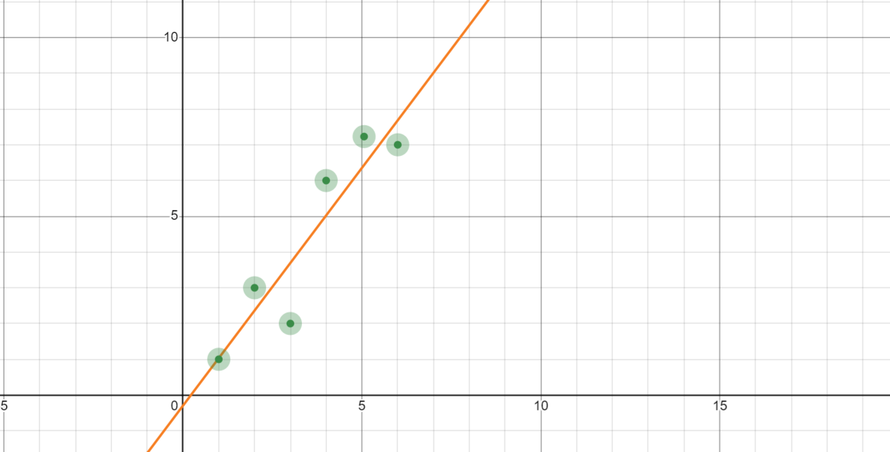

## 线性回归

### 引入

&emsp; 我们在高中的时候都学过线性回归，在这我们回顾一下

&emsp; 在高中的课程中，我们会被给得到一组 ${x_m}$ 和一组 ${y_m}$，然后我们想用 $h(x) = \hat{y} = ax + b$ 来拟合这组数据使得整体上 $h(x_i) \approx y_i$ 也就是这样：

&emsp; 而在高中教材中 $a$ 和 $b$ 都给出的准确的计算式（其中 $\bar{x}$ 和 $\bar{y}$ 是${x_m}$ 和 ${y_m}$ 的平均数）：

$$
\begin{aligned}
\hat{b} = & \frac{\sum\limits_{i = 1}^m(x_i - \bar{x})(y_i - \bar{y})}{\sum\limits_{i = 1}^m(x_i-\bar{x})^2} = \frac{\sum\limits_{i = 1}^mx_iy_i - m\bar{x}\bar{y}}{\sum\limits_{i = 1}^mx_i^2 - m\bar{x}^2} \\
a = & \bar{y} - \hat{b}\bar{x}
\end{aligned}
$$

&emsp; 而在机器学习中，我们希望计算机通过某种算法学习出一组 $a, b$，使得这条直线满足上述要求。

### 进入正题

&emsp; 在我们要解决的线性回归问题中，我们不仅不能使用上述已知的表达式解，我们还可以将维度升高。比如我们的数组 ${x_m}$ 中的每个 $x^{(i)}$ 不再是一个标量，而是一个 $n$ 维的向量，同理我们的 $w^{(i)}$ 也是一个 $n$ 维的向量：

$$
x^{(i)} = \begin{bmatrix} x^{(i)}_1 \\ x^{(i)}_2 \\ \vdots \\ x^{(i)}_n \end{bmatrix} \;\;\;\;\;\; w = \begin{bmatrix} w^{(i)}_1 \\ w_2 \\\vdots \\ w_n \end{bmatrix}
$$

&emsp; 然后我们就要用我们构造出来的 $h(x^{(i)})$ 来拟合 $y^{(i)}$：

$$ \hat{y} = h(x^{(i)}) = \sum_{j = 1}^n w_jx^{(i)}_j + b = w^Tx^{(i)} + b $$

&emsp; 在这里，我们定义 $J(w, b) = \frac 1{2m}\sum\limits_{i = 1}^m(h(x^{(i)}) - y^{(i)})^2$ 叫做损失函数 $cost\;function$，这个损失函数描述的是预测值 $\hat{y}$ 与真实值 $y$ 的差异程度，上述表达式很好的符合这个定义。

&emsp; 并且显然的，我们希望这个 $J(w, b)$ 越小越好。当 $J(w, b)$ 取到最小值时，我们认为 $h(x)$ 对 $y$ 的拟合达到最完美。

### 梯度下降---最小化 $J(w, b)$

&emsp; 我们觉得写成 $h(x) = w^Tx + b$ 太丑了，所以我们考虑令 $x^{(i)}_0 = 1$，并新增 $w_0$ 使得每个 $x^{(i)}$ 和 $w$ 都变成一个 $n + 1$ 维的向量：

$$
x^{(i)} = \begin{bmatrix} x^{(i)}_0 \\ x^{(i)}_1 \\ x^{(i)}_2 \\ \vdots \\ x^{(i)}_n \end{bmatrix} \;\;\;\;\;\; w = \begin{bmatrix} w_0 \\ w^{(i)}_1 \\ w_2 \\\vdots \\ w_n \end{bmatrix}
$$

&emsp; 于是 $h(x) = w^Tx$ 这样就好看多了qwq，并且此时 $J(w) = \frac 1{2m}\sum\limits_{i = 1}^m(h(x^{(i)}) - y^{(i)})^2$

&emsp; 我们想做的就是一下描述的事情：

1. 开始时对 $w$ 随机赋值
2. 持续改变 $w$ 的值，使得 $J(w)$ 的值减小，直到我们最后走到期望的最小值

&emsp; 然后这里我们介绍一种名为梯度下降 $gradient \; descent$ 的算法来执行第二部，感性的理解就是在某一点找到 "下山" 的方向，并沿着这个方向走一步，并且重复这个动作知道走到 "山脚下"。

&emsp; 具体来说就是每次计算 $J(w)$ 对每个 $w_i$ 的偏导数，然后执行：

$$ 
\begin{aligned}
&for \; i \; range \; from \; 0 \; to \; n \{ \\
&\;\;\;\;\;\;\;\; w_j := w_j - \alpha \frac{\partial}{\partial w_j}J(w) \\
&\}
\end{aligned}
$$

&emsp; 其中 $\alpha$ 是 步长 $learning \; rate$，表示这一步的大小。

&emsp; 这样看着可能不太直观，我们举个二维的例子更清晰的展示一下：

&emsp; 这里，这个红色的曲线就是我们的 $J(w)$。我们在起点对 $J(w)$ 求导，得到了蓝色的切线的斜率，这个斜率显然是个正数，于是我们沿着负方向走一步，这一步的大小取决于 $\alpha$。