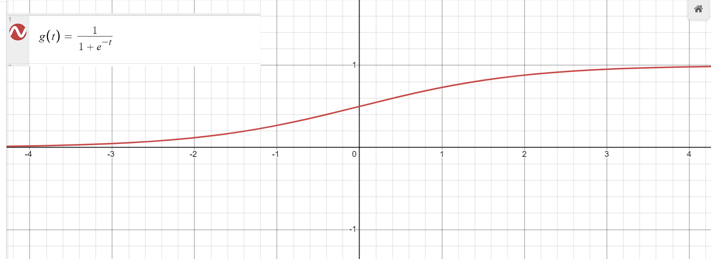
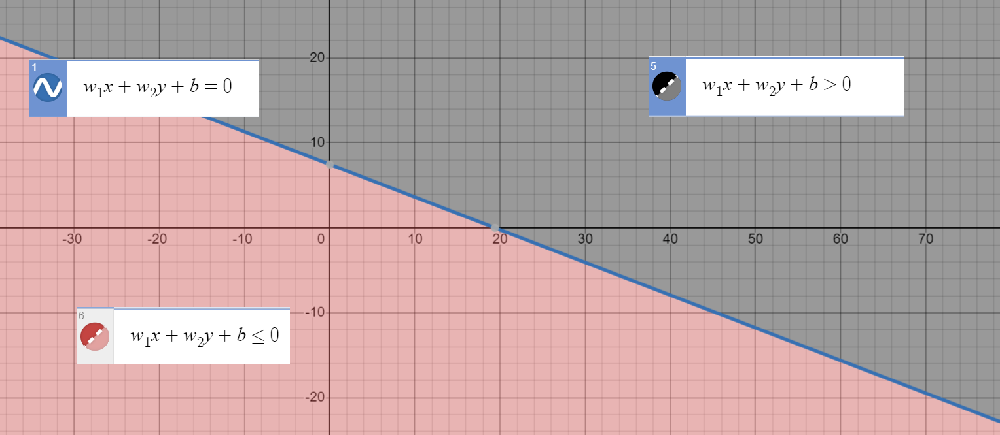
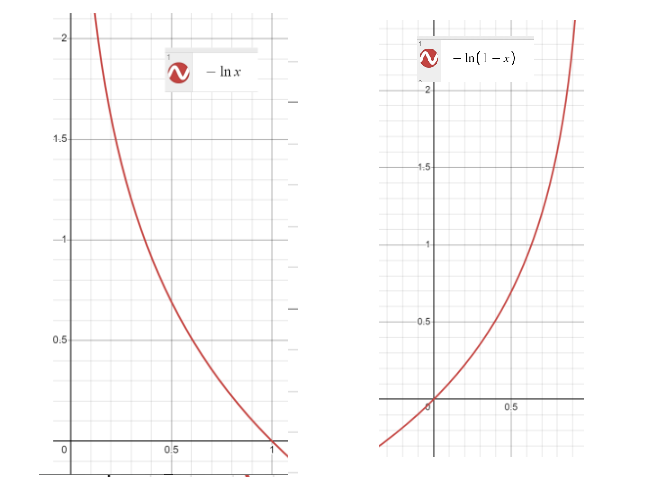

## 逻辑回归

前情提要：[线性回归](./LinearRegression.md)

### 关于分类 $Classification$

&emsp; 在逻辑回归中，我们只讨论 $y\in\{0, 1\}$ 的情况。其中 $1$ 表示 $positive \; class$，$0$ 表示 $negative \; class$。

### 对线性回归进行修改

&emsp; 在线性回归中，我们有 $h(x) = w^Tx$（这里写的是增加了 $x^{(i)}_0$ 和 $w_0$ 的），而在逻辑回归中，我们希望 $h(x) \in [0, 1]$，而 $h(x)$ 的值具体代表着 $y = 1$ 的概率，所以我们需要引入一个函数：$sigmoid \; function$，也叫 $logistic \; function$：

$$ g(t) = \frac{1}{1 + e^{-t}} $$

&emsp; 图像长这样：

&emsp; 我们可以看到，这个函数过点 $(0, 0.5)$

&emsp; 我们考虑把 $h(x)$ 改成这样：

$$ h(x^{(i)}) = g(w^Tx^{(i)}) = P(y = 1 | x ; w) $$

&emsp; 如果我们考虑将概率超过 $\frac 12$ 的归为 $y = 1$ 的一类，并把概率小于 $\frac 12$ 的归为 $y = 0$ 的这一类的话，我们会发现一件事：

1. $h(x^{(i)}) > \frac 12$ 时 $g(w^Tx^{(i)}) > \frac12$ 又因为 $g(t)$ 单增且过 $(0, \frac 12)$，所以此时 $w^Tx^{(i)} > 0$
2. $h(x^{(i)}) \le \frac 12$ 时 $g(w^Tx^{(i)}) \le \frac12$ 又因为 $g(t)$ 单增且过 $(0, \frac 12)$，所以此时 $w^Tx^{(i)} \le 0$

&emsp; 也就是说：

1. y被判定为 $1$ 时 $w^Tx^{(i)} > 0$
2. y被判定为 $0$ 时 $w^Tx^{(i)} \le 0$

&emsp; 而在线性回归中 $w^Tx^{(i)}$ 是表示我们拟合出来的那条直线（二维的情况下，一下解释也是二维的情况下，高维就类比就行了）。而并且上过高中的都知道，$w^Tx^{(i)} > 0$ 表示的是这条直线上方的半平面部分，而 $w^Tx^{(i)} \le 0$ 表示的是这条直线下方的半平面部分。

&emsp; 也就是说，我们用 $w^Tx^{(i)}$ 这条直线将平面分成了两部分，一部分中的点是 $y = 1$ 的点，另一部分是 $y = 0$ 的点。

### 构造 $cost \; function$

&emsp; 同样的，我们考虑和线性回归一样构造一个表示差异程度的函数，然后用 $GD$ 最小化它就解决了，这里，我们有：

$$ cost(x, y) = \left\{ \begin{array}{} -\ln (h(x)) & if \;\; y = 1 \\ -\ln (1 - h(x)) & if \;\; y = 0 \end{array}\right. $$

&emsp; 也可以写成：

$$ cost(x, y) = -\bigg[y\ln h(x) + (1 - y)\ln (1 - h(x))\bigg] $$

&emsp; 我们来分类讨论一下：

1. $y = 1$ 时，$h(x) \rightarrow 1$ 时，$cost$ 应该趋近于 $0$ 且 $h(x) \rightarrow 0$ 时，$cost$ 应该很大。而 $-\ln x$ 的图像刚好满足这个性质
2. $y = 0$ 时，$h(x) \rightarrow 0$ 时，$cost$ 应该趋近于 $0$ 且 $h(x) \rightarrow 1$ 时，$cost$ 应该很大。而 $-\ln (1-x)$ 的图像刚好满足这个性质

&emsp; 然后我们就有我们的 $cost \; function$：

$$ J(w) = -\sum_{i = 1}^m \bigg[y\ln h(x) + (1 - y)\ln (1 - h(x))\bigg] $$

&emsp; 之后 $gd$ 就搞定了