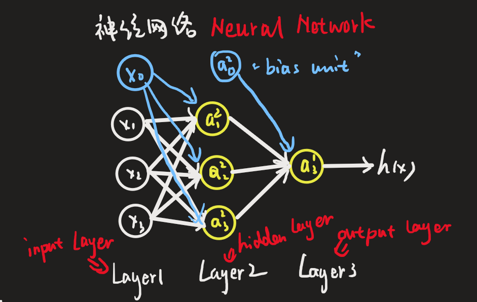
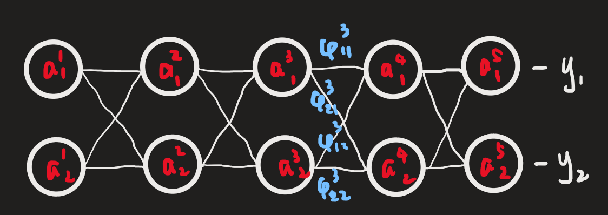

## 神经网络

### 计算

&emsp; 神经网络非常简单，举个例子就理解了（最后一层的那个写错了，应该是 $a^{(3)}_1$）：

&emsp; $notation$： $a^{(i)}_j$ 表示第 $i$ 层的第 $j$ 个单元。$w^{(j)}$ 表示权重矩阵，控制从 $j$ 层到 $j + 1$ 层的映射。

&emsp; 其中：

$$
\begin{aligned}
a^{(2)}_1 = & g\bigg( w^{(1)}_{10} x_0 + w^{(1)}_{11} x_1 + w^{(1)}_{12} x_2 + w^{(1)}_{13} x_3 \bigg)\\
a^{(2)}_2 = & g\bigg( w^{(1)}_{20} x_0 + w^{(1)}_{21} x_1 + w^{(1)}_{22} x_2 + w^{(1)}_{23} x_3 \bigg)\\
a^{(2)}_3 = & g\bigg( w^{(1)}_{30} x_0 + w^{(1)}_{31} x_1 + w^{(1)}_{32} x_2 + w^{(1)}_{33} x_3 \bigg)\\

h(x) = a^{(3)}_1 = &g\bigg( w^{(2)}_{10}a^{(2)}_0 + w^{(2)}_{11}a^{(2)}_1 + w^{(2)}_{12}a^{(2)}_2 + w^{(2)}_{13}a^{(2)}_3 \bigg)
\end{aligned}
$$

&emsp; 如果向量化一下，那就是：

$$
x = \begin{bmatrix} x_0 \\ x_1 \\ x_2 \\ x_3 \end{bmatrix}, \;\;\;\; w^{(1)} = \begin{bmatrix} w^{(1)}_{10} & w^{(1)}_{11} & w^{(1)}_{12} & w^{(1)}_{13} \\ w^{(1)}_{20} & w^{(1)}_{21} & w^{(1)}_{22} & w^{(1)}_{23} \\ w^{(1)}_{30} & w^{(1)}_{31} & w^{(1)}_{32} & w^{(1)}_{33} \end{bmatrix}
$$

&emsp; 然后有：

$$ z^{(2)} = w^{(1)}x = \begin{bmatrix} z^{(2)}_1 \\ z^{(2)}_2 \\ z^{(2)}_3 \end{bmatrix}, \;\;\;\;a^{(2)} = g(z^{(2)}) = \begin{bmatrix} a^{(2)}_1 \\ a^{(2)}_2 \\ a^{(2)}_3 \end{bmatrix} $$

&emsp; 下一层是：

$$ a^{(2)} = \begin{bmatrix} a^{(2)}_{0} \\ a^{(2)}_{1} \\ a^{(2)}_{2} \\ a^{(2)}_{3} \end{bmatrix}, \;\;\;\;w^{(2)} = \begin{bmatrix} w^{(2)}_{20} & w^{(2)}_{21} & w^{(2)}_{22} & w^{(2)}_{23} \end{bmatrix} $$

$$
z^{(3)} = w^{(2)}a^{(2)} = \begin{bmatrix} z^{(3)}_1 \end{bmatrix}, \;\;\;\; a^{(3)} = g(z^{(3)}) = \begin{bmatrix} a^{(3)}_1 \end{bmatrix}
$$

&emsp; 以上就是神经网络的计算方式，其实还是很好理解也很好实现的qwq

### 后向传播 $Back \; Propagation$

&emsp; 现在就是考虑如何计算出 $w^{(i)}$ 这么多矩阵了。（$notation$：$L$ 表示神经网络的层数，$S_l$ 表示 $l$ 层的节点数，$k$ 表示输出层的节点数）

&emsp; 我们仍然考虑用类似 $GD$ 的方法，于是我们考虑 $\min\limits_wJ(w)$，其中：

$$ J(w) = \frac 1m \sum_{i = 1}^m\sum_{k = 1}^{S_L}\frac 12 \bigg[ (h(x_i))_k - y_{ik} \bigg]^2 $$

&emsp; 然后我们就是要求解 $\frac{\partial J(w)}{\partial w^{(l)}_{ij}}$。

&emsp; 我们考虑将所有的训练数据分开求解，对于其中一个训练数据 $(x_i, y_i)$ 来说：

$$ J_i = \sum_{k = 1}^{S_L}\frac 12 \bigg[ (h(x_i))_k - y_{ik} \bigg]^2 $$

&emsp; 我们定义 $\delta^{(l)}_i$ 表示 $a^{(l)}_i$ 对真实值的差值，也就是：

$$ \delta^{(l)}_j = \frac{\partial J_i}{\partial z^{(l)}_j} $$

&emsp; 而对于最后一层来说：

$$
\begin{aligned}
\delta^{(L)}_j = \frac{\partial J_i}{\partial z^{(L)}_j} = \frac{\partial J_i}{\partial a^{(L)}_j} \cdot \frac{\partial a^{(L)}_j}{\partial z^{(L)}_j} = &\frac{\partial \sum\limits_{k = 1}^{S_L}\frac 12 [(h(x_i))_k - y_{ik}]^2}{\partial a^{(L)}_j} \cdot \frac{\partial g(z^{(L)}_j)}{\partial z^{(L)}_j} \\
= & \frac{\partial \sum\limits_{k = 1}^{S_L}\frac 12 [a^{(L)}_k - y_{ik}]^2}{\partial a^{(L)}_j} \cdot g'(z^{(L)}_j) = (a^{(L)}_j - y_{ik}) \cdot g'(z^{(L)}_j)
\end{aligned}
$$

&emsp; 而我们要算的是：

$$
\begin{aligned}
\frac{\partial J_i}{\partial w^{(L-1)}_{jk}} = \frac{\partial J_i}{\partial a^{(L)}_j} \cdot \frac{\partial a^{(L)}_j}{\partial z^{(L)}_j} \cdot \frac{\partial z^{(L)}_j}{\partial w^{(L-1)}_{jk}} = \delta^{(L)}_j \cdot \frac{\partial z^{(L)}_j}{\partial w^{(L-1)}_{jk}}
\end{aligned}
$$

&emsp; 所以我们只需要计算 $\frac{\partial z^{(L)}_j}{\partial w^{(L-1)}_{jk}}$ 就可以了

&emsp; 我们又知道：

$$ z^{(L)}_j = \sum_{i = 1}^{S_{L - 1}}w^{(L - 1)}_{ji}a^{(L-1)}_i $$

&emsp; 所以：

$$ \frac{\partial z^{(L)}_j}{\partial w^{(L-1)}_{jk}} = \frac{\sum\limits_{i = 1}^{S_{L - 1}}\partial w^{(L-1)}_{ji}a^{(L-1)}_i }{\partial w^{(L-1)}_{jk}} = a^{(L-1)}_k $$

&emsp; 于是：

$$ \frac{\partial J_i}{\partial w^{(L-1)}_{jk}} = \delta^{(L)}_j \cdot a^{(L-1)}_k $$

&emsp; 现在我们有了最后一层，我们考虑能不能往前推回去，这里我们以一个简单的例子来更直观的计算（这里我画图时把 $w$ 写成 $\varphi$ 了qwq）：

&emsp; 我们假设我们要计算 $J$ 对 $w^{(3)}_{11}$ 求偏导：

$$ \frac{\partial J_i}{\partial w^{(3)}_{11}} = \frac{\partial (J_{i1} + J_{i2})}{\partial w^{(3)}_{11}} = \frac{\partial J_{i1}}{\partial w^{(3)}_{11}} + \frac{\partial J_{i2}}{\partial w^{(3)}_{11}} $$

&emsp; 我们考虑分开求 $\frac{\partial J_{i1}}{\partial w^{(3)}_{11}}$ 和 $\frac{\partial J_{i2}}{\partial w^{(3)}_{11}}$

&emsp; 先算前一项，沿着神经网络做分布求导：

$$
\begin{aligned}
\frac{\partial J_{i1}}{\partial w^{(3)}_{11}} = & \frac{\partial J_{i1}}{\partial a^{(5)}_1} \cdot \frac{\partial a^{(5)}_1}{\partial z^{(5)}_1} \cdot \frac{\partial z^{(5)}_1}{\partial a^{(4)}_1} \cdot \frac{\partial a^{(4)}_1}{\partial z^{(4)}_1} \cdot \frac{\partial z^{(4)}_1}{w^{(3)}_{11}} \\
= & \delta^{(5)}_1 \cdot \frac{\partial z^{(5)}_1}{\partial a^{(4)}_1} \cdot \frac{\partial a^{(4)}_1}{\partial z^{(4)}_1} \cdot \frac{\partial z^{(4)}_1}{w^{(3)}_{11}}
\end{aligned}
$$

&emsp; 我们又有：

$$
\begin{aligned}
z^{(5)}_1 = w^{(4)}_{11}a^{(4)}_1 + w^{(4)}_{12}a^{(4)}_2 \rightarrow & \frac{\partial z^{(5)}_1}{\partial a^{(4)}_1} = w^{(4)}_{11} \\
a^{(4)}_1 = g(z^{(4)}_1) \rightarrow & \frac{\partial a^{(4)}_1}{\partial z^{(4)}_1} = g'(z^{(4)}_1) \\
z^{(4)}_1 = w^{(3)}_{11}a^{(3)}_1 + w^{(3)}_{12}a^{(3)}_2 \rightarrow & \frac{\partial z^{(4)}_1}{\partial w^{(3)}_{11}} = a^{(3)}_1 
\end{aligned}
$$

&emsp; 所以：

$$ \frac{\partial J_{i1}}{\partial w^{(3)}_{11}} = \delta^{(5)}_1 \cdot w^{(4)}_{11} \cdot g'(z^{(4)}_1) \cdot a^{(3)}_1 $$

&emsp; 同样的，我们也可以推出（这里因为和前面几乎一样所以过程就省略了~~（绝对不是因为公式打起来太麻烦了qwq~~）：

$$ \frac{\partial J_{i2}}{\partial w^{(3)}_{11}} = \delta^{(5)}_2 \cdot w^{(4)}_{21} \cdot g'(z^{(4)}_1) \cdot a^{(3)}_1 $$

&emsp; 所以把这俩玩意儿加起来就能得到：

$$
\begin{aligned}
\frac{\partial J_i}{\partial w^{(3)}_{11}} = & \delta^{(5)}_1 \cdot w^{(4)}_{11} \cdot g'(z^{(4)}_1) \cdot a^{(3)}_1 + \delta^{(5)}_2 \cdot w^{(4)}_{21} \cdot g'(z^{(4)}_1) \cdot a^{(3)}_1\\
= & (\delta^{(5)}_1 \cdot w^{(4)}_{11} + \delta^{(5)}_2 \cdot w^{(4)}_{21})\cdot g'(z^{(4)}_1) \cdot a^{(3)}_1
\end{aligned}
$$

&emsp; 然后我们令：

$$ \delta^{(4)}_1 = (\delta^{(5)}_1 \cdot w^{(4)}_{11} + \delta^{(5)}_2 \cdot w^{(4)}_{21}) \cdot g'(z^{(4)}_1) $$

&emsp; 于是我们就有：

$$ \frac{\partial J_i}{\partial w^{(3)}_{11}} = \delta^{(4)}_1 \cdot a^{(3)}_1 $$

&emsp; 我们发现，这个式子跟我们上面的

$$ \frac{\partial J_i}{\partial w^{(L-1)}_{jk}} = \delta^{(L)}_j \cdot a^{(L-1)}_k $$

&emsp; 这个的结构完全一致。

&emsp; 所以我们得到了一个递推式：

$$ \delta^{(4)}_1 = (\delta^{(5)}_1 \cdot w^{(4)}_{11} + \delta^{(5)}_2 \cdot w^{(4)}_{21}) \cdot g'(z^{(4)}_1) $$

&emsp; 同样的，我们也能得到：

$$ \delta^{(4)}_2 = (\delta^{(5)}_1 \cdot w^{(4)}_{12} + \delta^{(5)}_2 \cdot w^{(4)}_{22}) \cdot g'(z^{(4)}_2) $$  

&emsp; 也可以写成向量的形式：

$$ \begin{bmatrix} \delta^{(4)}_1 \\ \delta^{(4)}_2 \end{bmatrix} = \left(\begin{bmatrix} w^{(4)}_{11} & w^{(4)}_{12} \\ w^{(4)}_{21} & w^{(4)}_{22} \end{bmatrix} \begin{bmatrix} \delta^{(5)}_1 \\ \delta^{(5)}_2 \end{bmatrix}\right) \cdot* \begin{bmatrix} g'(z^{(4)}_1) \\ g'(z^{(4)}_2) \end{bmatrix} $$

&emsp; 也就是：

$$
\delta^{(4)} = \bigg[(w^{(4)})^T\delta^{(5)}\bigg] \cdot* g'(z^{(4)})
$$

&emsp; 同样的，我们也能将这个式子推广到其他层：

$$ \delta^{(l)} = \bigg[ (w^{(l)})^T\delta^{(l+1)} \bigg] \cdot* g'(z^{(l)}) $$

&emsp; 这个式子就是我们 $back \; propagation$ 的关键了。

&emsp; 然后我们对于每个训练数据 $i$ 都跑一遍 $BP$ 计算出 $\frac{\partial J_i}{\partial w^{(L-1)}_{jk}}$，然后令 $\Delta^{(l)}_{jk}$ 存储 $\frac{\partial J_i}{\partial w^{(L-1)}_{jk}}$ 的和。最后跑完 $m$ 个训练数据后令 $D^{(l)}_{jk} = \frac 1m\Delta^{(l)}_{jk}$，我们就得到了：

$$ \frac{\partial}{\partial w^{(l)}_{jk}}J(w) = D^{(l)}_{jk} $$

&emsp; 然后再进行 $GD$ 就可以了。