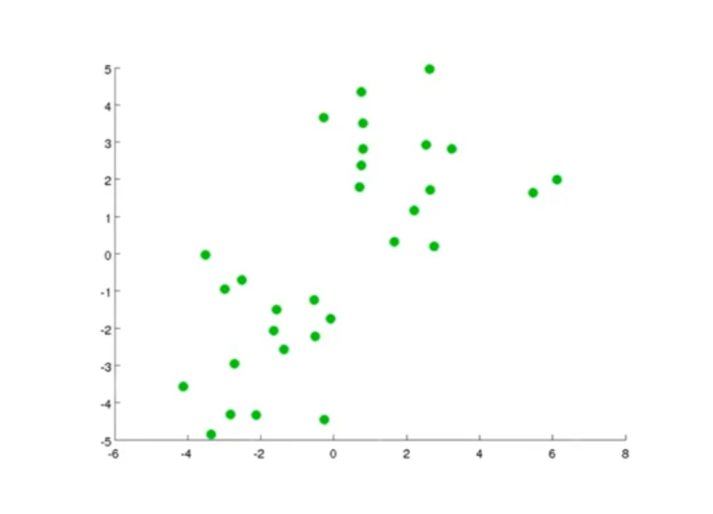
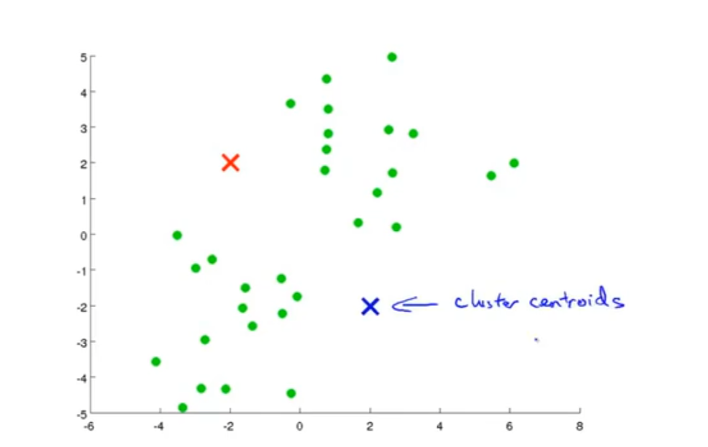
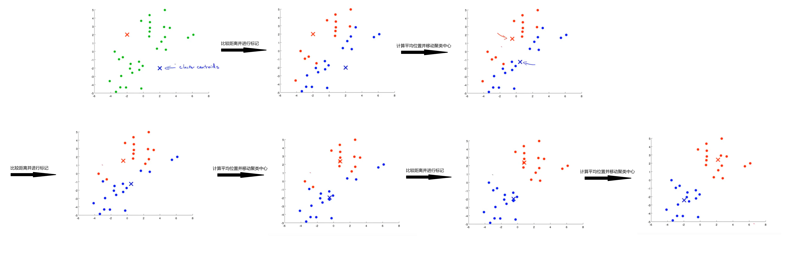

## K均值聚类

&emsp; $K-means$ 是 聚类 $clustering$ 算法的一种，就是给你一坨东西，让你给他们分类：

&emsp; 我们的 $K-means$ 大概是这样一个流程：

1. 第一步随机生成两个点（因为这里我想分两类，你想分几类你就弄几个点），标记为两个**聚类中心** $cluster \; centriod$，像这样：

2. 然后重复以下两个步骤：

&emsp;&emsp; 1. 遍历每个点 $x^{(i)}$，分别计算点 $x^{(i)}$ 到两个聚类中心的距离 $d_1$ 和 $d_2$，然后比较大小。并标记这个点为距离更小的那一类 

&emsp;&emsp; 2. 分别遍历同一类的所有点，计算这些点的几何平均位置，并把聚类中心移动到这个位置

&emsp; 这样说起来可能很抽象，我们还是用图像来更清晰的表示一下这个过程：

&emsp; 图画到这里我们就能明显的观察到两个聚类已经被划分好了。