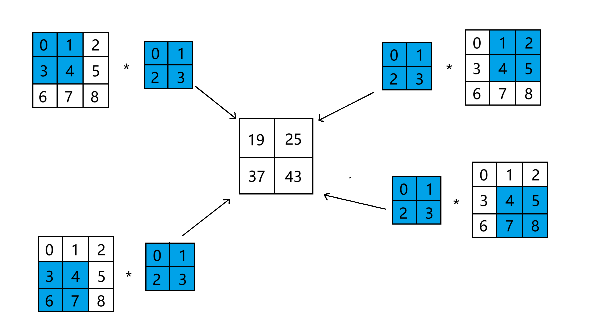
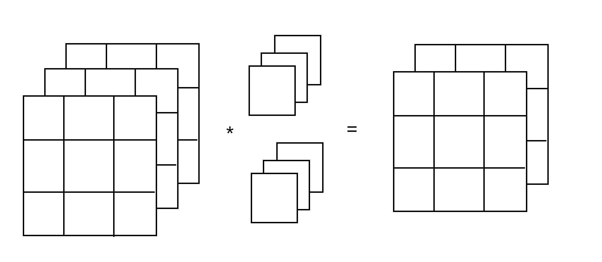
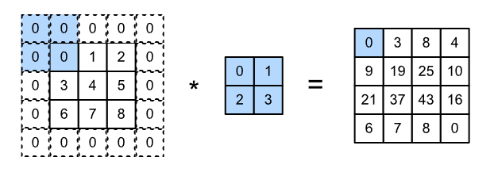
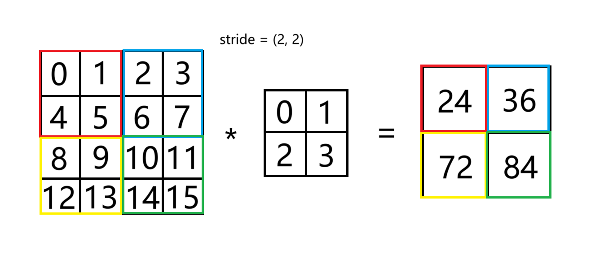
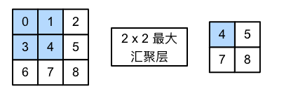

# 卷积神经网络 LeNet

## 1. 计算方法

### （1）输入和输出channel = 1时

&emsp; 首先我们要知道channel是什么意思，~~顾名思义channel就是“通道”的意思qwq~~。我们来举个例子，在计算机视觉中，如果一张图片是黑白的，那么每个像素点都是有一个信息也就是这个像素点的灰度。但是对于一张彩色图片来说，每个像素点都是由三个信息叠加而成的，也就是 $RBG$ 三个颜色的“灰度”。

&emsp; 于是我们对黑白照片操作变成矩阵的时候，我们就会直接将灰度拿来用，把它变成一个二维的矩阵。

&emsp; 而对于彩色照片来说，我们就会建立一个高为 $3$ 的三维张量来存储这个图片。这里的所谓“高度3”就是我们的channel。

&emsp; 这里我们先说只有一个通道的时候（也就是二维的时候）卷积网络的计算方法，我们来看这样一个图：



&emsp; 这里就很形象的展示了卷积的计算方法，其中 $3 \times 3$ 的矩阵我们叫做 **输入矩阵**，$2 \times 2$ 的蓝色矩阵叫做 **核函数**，最后得到的 $2 \times 2$ 的白色矩阵叫做 **输出矩阵**。

&emsp; 其中，我们有：

$$
0 \times 0 + 1 \times 1 + 3 \times 2 + 4 \times 3 = 19 \\
0 \times 1 + 2 \times 1 + 4 \times 2 + 5 \times 3 = 25 \\
3 \times 0 + 4 \times 1 + 6 \times 2 + 7 \times 3 = 37 \\
4 \times 0 + 5 \times 1 + 7 \times 2 + 8 \times 3 = 43
$$

&emsp; 这就是最基本的计算方法了。

&emsp; 用代码写出来就是这样：

```python
from mxnet import gluon, np, npx, autograd, nd
from mxnet.gluon import nn

data = nd.arange(9).reshape((1, 1, 3, 3))
w = nd.arange(4).reshape((1, 1, 2, 2))
out = nd.Convolution(data, w, nd.array([0]), kernel = w.shape[2:], num_filter = w.shape[0])
print("input :", data, "\n\nweight :", w, "\n\noutput :", out)
```

&emsp; 输出出来是这样：

```
input : 
[[[[0. 1. 2.]
   [3. 4. 5.]
   [6. 7. 8.]]]]
<NDArray 1x1x3x3 @cpu(0)> 

weight : 
[[[[0. 1.]
   [2. 3.]]]]
<NDArray 1x1x2x2 @cpu(0)> 

output : 
[[[[19. 25.]
   [37. 43.]]]]
<NDArray 1x1x2x2 @cpu(0)>
```

### （2）对于输入的channel > 1 但 输出的channel = 1的时候

&emsp; 然后对于channe 输入的channel > 1但输出的channel = 1的时候，我们还是举例说明计算方法：


&emsp; 这里我们的输入矩阵变成了红色的这两个，也就是一个 $2 \times 3 \times 3$  的张量，而我们的核函数变成了这两个蓝色的，也就是一个 $2 \times 2 \times 2$ 的张量。我们计算时，分别对对应的张量进行一次卷积，得到黄色的两个矩阵，然后再把这俩加起来就得到了输出矩阵。

&emsp; 写代码的话就是这样：

```python
w = nd.arange(8).reshape((1, 2, 2, 2))
data = nd.arange(18).reshape((1, 2, 3, 3))
out = nd.Convolution(data, w, nd.array([0]), kernel = w.shape[2:], num_filter = w.shape[0])
print("input :", data, "\n\nweight :", w, "\n\noutput :", out)
```

&emsp; 输出就是这样：

```
input : 
[[[[ 0.  1.  2.]
   [ 3.  4.  5.]
   [ 6.  7.  8.]]

  [[ 9. 10. 11.]
   [12. 13. 14.]
   [15. 16. 17.]]]]
<NDArray 1x2x3x3 @cpu(0)> 

weight : 
[[[[0. 1.]
   [2. 3.]]

  [[4. 5.]
   [6. 7.]]]]
<NDArray 1x2x2x2 @cpu(0)> 

output : 
[[[[268. 296.]
   [352. 380.]]]]
<NDArray 1x1x2x2 @cpu(0)>
```

### （3）对于输入的channel > 1 且 输出的channel > 1的时候

&emsp; 还是老样子，举个例子：



&emsp; 这里的输入变成了 $3 \times 3 \times 3$ 的张量，而我们的核函数则是 $2 \times 3 \times 1 \times 1$ 的张量。这里，我们的计算方法就是用核函数的第一层跟输入做一次卷积，得到第一个矩阵，然后用核函数的第二层和输入再做一次卷积得到第二个矩阵，这两个矩阵就是我们的输出了。

&emsp; 代码如下：

```python
data = nd.arange(27).reshape((1, 3, 3, 3))
w = nd.arange(6).reshape((2, 3, 1, 1))
out = nd.Convolution(data, w, nd.array([0, 0]), kernel = w.shape[2:], num_filter = w.shape[0])
print("input :", data, "\n\nweight :", w, "\n\noutput :", out)
```

&emsp; 输出：

```
input : 
[[[[ 0.  1.  2.]
   [ 3.  4.  5.]
   [ 6.  7.  8.]]

  [[ 9. 10. 11.]
   [12. 13. 14.]
   [15. 16. 17.]]

  [[18. 19. 20.]
   [21. 22. 23.]
   [24. 25. 26.]]]]
<NDArray 1x3x3x3 @cpu(0)> 

weight : 
[[[[0.]]
  [[1.]]
  [[2.]]]

 [[[3.]]
  [[4.]]
  [[5.]]]]
<NDArray 2x3x1x1 @cpu(0)> 

output : 
[[[[ 45.  48.  51.]
   [ 54.  57.  60.]
   [ 63.  66.  69.]]

  [[126. 138. 150.]
   [162. 174. 186.]
   [198. 210. 222.]]]]
<NDArray 1x2x3x3 @cpu(0)>
```

### （4） 关于代码的一些事

&emsp; 我们把刚才的三段代码贴过来，然后我们观察一下看看能不能发现什么规律：

```python
data = nd.arange(9).reshape((1, 1, 3, 3))
w = nd.arange(4).reshape((1, 1, 2, 2))
out = nd.Convolution(data, w, nd.array([0]), kernel = w.shape[2:], num_filter = w.shape[0])
print("input :", data, "\n\nweight :", w, "\n\noutput :", out)
```

```python
w = nd.arange(8).reshape((1, 2, 2, 2))
data = nd.arange(18).reshape((1, 2, 3, 3))
out = nd.Convolution(data, w, nd.array([0]), kernel = w.shape[2:], num_filter = w.shape[0])
print("input :", data, "\n\nweight :", w, "\n\noutput :", out)
```

```python
data = nd.arange(27).reshape((1, 3, 3, 3))
w = nd.arange(6).reshape((2, 3, 1, 1))
out = nd.Convolution(data, w, nd.array([0, 0]), kernel = w.shape[2:], num_filter = w.shape[0])
print("input :", data, "\n\nweight :", w, "\n\noutput :", out)
```

&emsp; 我们会发现，我们的 $data.shape$ 和 $w.shape$ 和 $b.shape$ 都是有讲究的，其中 $data.shape = (batch\_size, channels, height, width)$，而 $w.shape = (num\_filter, input\_channels, kernel\_height, kernel\_width)$。然后就是 $b.shape = (1, num\_filter)$

## 2. padding & strides

### （1） 填充 Padding

&emsp; 如上所述，在应用多层卷积时，我们常常丢失边缘像素。由于我们通常使用小卷积核，因此对于任何单个卷积，我们可能只会丢失几个像素。但随着我们应用许多连续卷积层，累积丢失的像素数就多了。解决这个问题的简单方法即为*填充*（padding）：在输入图像的边界填充元素（通常填充元素是$0$）。例如，:numref:`img_conv_pad`中，我们将$3 \times 3$输入填充到$5 \times 5$，那么它的输出就增加为$4 \times 4$。阴影部分是第一个输出元素以及用于输出计算的输入和核张量元素：$0\times0+0\times1+0\times2+0\times3=0$。




&emsp; 代码是这样的：

```python

w = nd.arange(4).reshape((1, 1, 2, 2))
data = nd.arange(9).reshape((1, 1, 3, 3))
out = nd.Convolution(data, w, nd.array([0]), kernel = w.shape[2:], num_filter = w.shape[0], pad = (1, 1))       # pad:矩阵向外扩展的距离
print("input :", data, "\n\nweight :", w, "\n\noutput :", out)
```

&emsp; output：

```
input : 
[[[[0. 1. 2.]
   [3. 4. 5.]
   [6. 7. 8.]]]]
<NDArray 1x1x3x3 @cpu(0)> 

weight : 
[[[[0. 1.]
   [2. 3.]]]]
<NDArray 1x1x2x2 @cpu(0)> 

output : 
[[[[ 0.  3.  8.  4.]
   [ 9. 19. 25. 10.]
   [21. 37. 43. 16.]
   [ 6.  7.  8.  0.]]]]
<NDArray 1x1x4x4 @cpu(0)>
```

### （2） 步幅 Strides

&emsp; 我们看之前看到的都是每次把 $kernel$ 对准的一方移动一格所计算出来的输出，而 $stride$ 就是用来控制每次移动的步幅的：



&emsp; 这里就是 $stride = (2, 2)$ 说明步幅是 $2$，那我们每次移动就走两格。所以红色和 $kernel$ 乘起来就是 $24$，蓝色和 $kernel$ 乘起来就是 $36$，以此类推。

&emsp; 代码如下：

```python
data = nd.arange(16).reshape((1, 1, 4, 4))
w = nd.arange(4).reshape((1, 1, 2, 2))
out = nd.Convolution(data, w, nd.array([0]), kernel = w.shape[2:], num_filter = w.shape[0], stride = (2, 2))
print("input :", data, "\n\nweight :", w, "\n\noutput :", out)
```

&emsp; 输出：

```
input : 
[[[[ 0.  1.  2.  3.]
   [ 4.  5.  6.  7.]
   [ 8.  9. 10. 11.]
   [12. 13. 14. 15.]]]]
<NDArray 1x1x4x4 @cpu(0)> 

weight : 
[[[[0. 1.]
   [2. 3.]]]]
<NDArray 1x1x2x2 @cpu(0)> 

output : 
[[[[24. 36.]
   [72. 84.]]]]
<NDArray 1x1x2x2 @cpu(0)>
```

## 3. 汇聚层 Pooling

&emsp; 	与卷积层类似，汇聚层运算符由一个固定形状的窗口组成，该窗口根据其步幅大小在输入的所有区域上滑动，为固定形状窗口（有时称为汇聚窗口）遍历的每个位置计算一个输出。 然而，不同于卷积层中的输入与卷积核之间的互相关计算，汇聚层不包含参数。 相反，池运算是确定性的，我们通常计算汇聚窗口中所有元素的最大值或平均值。这些操作分别称为最大汇聚层（maximum pooling）和平均汇聚层（average pooling）

&emsp; 这里我们先说最大汇聚层：



&emsp; 这里其实就是：

$$
\max\{0, 1, 3, 4\} = 4 \\ \max\{1, 2, 4, 5\} = 5 \\\max\{3, 4, 6, 7\} = 7 \\ \max\{4, 5, 7, 8\} = 8
$$

&emsp; 再有就是平均汇聚层，其实跟上面一样，只是把 $\max$ 换成了 $mean()$ 而已

&emsp; 代码如下：

```python
data = nd.arange(9).reshape((1, 1, 3, 3))                                                      # 关于pooling
max_pool = nd.Pooling(data = data, pool_type = 'max', kernel = (2, 2))
avg_pool = nd.Pooling(data = data, pool_type = 'avg', kernel = (2, 2))
print("data :", data, "\n\nmax pool :", max_pool, "\n\navg pool :", avg_pool)
```

&emsp; 输出：

```
data : 
[[[[0. 1. 2.]
   [3. 4. 5.]
   [6. 7. 8.]]]]
<NDArray 1x1x3x3 @cpu(0)> 

max pool : 
[[[[4. 5.]
   [7. 8.]]]]
<NDArray 1x1x2x2 @cpu(0)> 

avg pool : 
[[[[2. 3.]
   [5. 6.]]]]
<NDArray 1x1x2x2 @cpu(0)>
```

## LeNet

&emsp; 说白了，这玩意儿就是用卷积层 convolution layer 替换了普通神经网络中的全连接层 dense layer，其他的也没什么区别...

&emsp; 首先就是一堆import

```python
from mxnet import gluon
from mxnet.gluon import nn
from d2l import mxnet as d2l
from mxnet import autograd, nd
import matplotlib.pyplot as plt
```

&emsp; 然后就是定义我们的 $LeNet$，也就是两层 $convolution$ 每次 $maxpooling$ 一下，再搞一层 $dense \;\; layer$ 再输出：

```python
net = nn.Sequential()
with net.name_scope():
    net.add(nn.Conv2D(channels = 20, kernel_size = 5, activation = 'relu'))
    net.add(nn.MaxPool2D(pool_size = 2, strides = 2))
    net.add(nn.Conv2D(channels = 50, kernel_size = 3, activation = 'relu'))
    net.add(nn.MaxPool2D(pool_size = 2, strides = 2))
    net.add(nn.Flatten())
    net.add(nn.Dense(128, activation = 'relu'))
    net.add(nn.Dense(10))

ctx = d2l.try_gpu()                                                  # 试试gpu能不能跑 如果报错则返回cpu
print("context :", ctx)
net.initialize(ctx = ctx)
print(net)
```

&emsp; 运行这段 代码后会输出以下内容：

```
context : cpu(0)
Sequential(
  (0): Conv2D(None -> 20, kernel_size=(5, 5), stride=(1, 1), Activation(relu))
  (1): MaxPool2D(size=(2, 2), stride=(2, 2), padding=(0, 0), ceil_mode=False, global_pool=False, pool_type=max, layout=NCHW)
  (2): Conv2D(None -> 50, kernel_size=(3, 3), stride=(1, 1), Activation(relu))
  (3): MaxPool2D(size=(2, 2), stride=(2, 2), padding=(0, 0), ceil_mode=False, global_pool=False, pool_type=max, layout=NCHW)
  (4): Flatten
  (5): Dense(None -> 128, Activation(relu))
  (6): Dense(None -> 10, linear)
)
```

&emsp; 然后就是从 $mnist$ load数据下来：

```python
batch_size, num_epoch, lr = 256, 10, 0.5
train_data, test_data = d2l.load_data_fashion_mnist(batch_size)
```

&emsp; 然后跟我们的 $softmax \;\; regression$ 里面一样，定义一些函数：

```python
softmax_cross_entropy = gluon.loss.SoftmaxCrossEntropyLoss()                          # 损失函数
trainer = gluon.Trainer(net.collect_params(), 'sgd', {'learning_rate' : lr})          # sgd

def accuracy(output, label):                                                          # 计算拟合的准确度
    return nd.mean(output.argmax(axis = 1) == label.astype('float32')).asscalar()     # argmax是把每一列的最大概率的index返回出来 然后和label比较是否相同 最后所有求个mean

def evaluate_accuracy(data_itetator, net, context):
    acc = 0.
    for data, label in data_itetator:
        output = net(data)
        acc += accuracy(output, label)
    return acc / len(data_itetator)
```

&emsp; 然后就是开始训练了（也和前面的 $softmax \;\; regression$ 是一样的：

```python
for epoch in range(num_epoch):
    train_loss, train_acc = 0., 0.
    for data, label in train_data:
        label = label.as_in_context(ctx)
        with autograd.record():
            out = net(data.as_in_context(ctx))
            loss = softmax_cross_entropy(out, label)
        loss.backward()
        trainer.step(batch_size)
        train_loss += nd.mean(loss).asscalar()
        train_acc += accuracy(out, label)
    # test_acc = 0.
    test_acc = evaluate_accuracy(test_data, net, ctx)
    print("Epoch  %d. Loss : %f, Train acc : %f, Test acc : %f" %
                (epoch, train_loss / len(train_data), train_acc / len(train_data), test_acc))
```

&emsp; 我们运行之后就能得到一下输出：

```
Epoch  0. Loss : 1.155733, Train acc : 0.567287, Test acc : 0.761133
Epoch  1. Loss : 0.558990, Train acc : 0.782680, Test acc : 0.826172
Epoch  2. Loss : 0.465726, Train acc : 0.821543, Test acc : 0.848633
Epoch  3. Loss : 0.420673, Train acc : 0.838697, Test acc : 0.857227
Epoch  4. Loss : 0.382026, Train acc : 0.855740, Test acc : 0.869824
Epoch  5. Loss : 0.358218, Train acc : 0.865320, Test acc : 0.871094
Epoch  6. Loss : 0.335073, Train acc : 0.873648, Test acc : 0.881641
Epoch  7. Loss : 0.317190, Train acc : 0.881250, Test acc : 0.884863
Epoch  8. Loss : 0.303633, Train acc : 0.885882, Test acc : 0.886133
Epoch  9. Loss : 0.291287, Train acc : 0.889993, Test acc : 0.886719
```

&emsp; 我们能看出这个的 $test \;\; accuracy$ 要比 $softmax$ 的高很多qwq

&emsp; 完成代码如下：

```python
from mxnet import gluon
from mxnet.gluon import nn
from d2l import mxnet as d2l
from mxnet import autograd, nd
import matplotlib.pyplot as plt

net = nn.Sequential()
with net.name_scope():
    net.add(nn.Conv2D(channels = 20, kernel_size = 5, activation = 'relu'))
    net.add(nn.MaxPool2D(pool_size = 2, strides = 2))
    net.add(nn.Conv2D(channels = 50, kernel_size = 3, activation = 'relu'))
    net.add(nn.MaxPool2D(pool_size = 2, strides = 2))
    net.add(nn.Flatten())
    net.add(nn.Dense(128, activation = 'relu'))
    net.add(nn.Dense(10))

ctx = d2l.try_gpu()                                                                   # 试试gpu能不能跑 如果报错则返回cpu
print("context :", ctx)
net.initialize(ctx = ctx)
print(net)

batch_size, num_epoch, lr = 256, 10, 0.5
train_data, test_data = d2l.load_data_fashion_mnist(batch_size)

softmax_cross_entropy = gluon.loss.SoftmaxCrossEntropyLoss()
trainer = gluon.Trainer(net.collect_params(), 'sgd', {'learning_rate' : lr})

def accuracy(output, label):                                                                     # 计算拟合的准确度
    return nd.mean(output.argmax(axis = 1) == label.astype('float32')).asscalar()                # argmax是把每一列的最大概率的index返回出来 然后和label比较是否相同 最后所有求个mean

def evaluate_accuracy(data_itetator, net, context):
    acc = 0.
    for data, label in data_itetator:
        output = net(data)
        acc += accuracy(output, label)
    return acc / len(data_itetator)

for epoch in range(num_epoch):
    train_loss, train_acc = 0., 0.
    for data, label in train_data:
        label = label.as_in_context(ctx)
        with autograd.record():
            out = net(data.as_in_context(ctx))
            loss = softmax_cross_entropy(out, label)
        loss.backward()
        trainer.step(batch_size)
        train_loss += nd.mean(loss).asscalar()
        train_acc += accuracy(out, label)
    # test_acc = 0.
    test_acc = evaluate_accuracy(test_data, net, ctx)
    print("Epoch  %d. Loss : %f, Train acc : %f, Test acc : %f" %
                (epoch, train_loss / len(train_data), train_acc / len(train_data), test_acc))
```