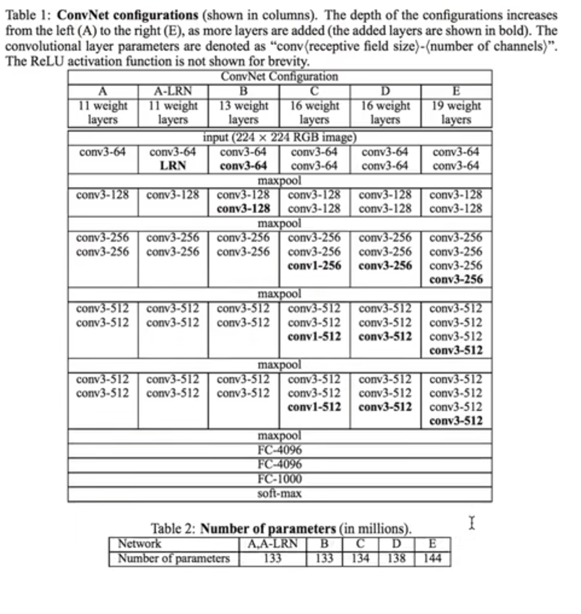

# VGG

&emsp; 我们已经见过了 $LeNet$ 和 $AlexNet$，一个是 $3$ 层，一个是 $7$ 层，那么如果我们想实现一些更多层的神经网络要怎么办呢，还是手动开每一层吗？

&emsp; 显然不能这么原始，所以我们想到了一件事：为社么不试试for循环呢qwq

&emsp; 这就是 $vgg$ 的本质了

&emsp; ~~这玩意儿虽然名字叫very deep network 但是现在看来这玩意儿也就那么几层 其实挺浅的哈哈qwq~~

## vgg_block

&emsp; 一个 $vgg\_block$ 就是一个小的 $net$，其中包含多个 $convolution \;\; layer$ 和一个 $maxpooling$，就像这样：

```python
from mxnet.gluon import nn

def vgg_block(num_convs, channels):
    out = nn.Sequential()
    with out.name_scope():
        for _ in range(num_convs):
            out.add(nn.Conv2D(channels = channels, kernel_size = 3, padding = 1, activation = 'relu'))
        out.add(nn.MaxPool2D(pool_size = 2, strides = 2))
    return out
```

&emsp; 然后我们可以定义一个block来试试效果：

```python
blk = vgg_block(2, 128)
blk.initialize()
x = nd.random.uniform(shape = (2, 3, 16, 16))                                                    # (batch_size, channels, height, width)
print(blk(x).shape)
```

&emsp; 输出的shape就是：

```
(2, 128, 8, 8)
```

## vgg_stack

&emsp; 我们先定义一个 $architecture$，它由很多个元组组成：

```python
architecture = ((1, 64), (1, 128), (2, 256), (2, 512), (2, 512))
```

&emsp; 每一个元组代表一个 $vgg\_block$，就像这样：

```python
def vgg_stack(architecture):
    out = nn.Sequential()
    with out.name_scope():
        for (num_convs, channels) in architecture:
            out.add(vgg_block(num_convs, channels))
    return out
```

## vgg net

&emsp; 最后我们的 $net$ 就是这样的：

```python
net = nn.Sequential()
with net.name_scope():
    net.add(vgg_stack(architecture))
    net.add(nn.Flatten())
    net.add(nn.Dense(4096, activation = 'relu'))
    net.add(nn.Dropout(.5))
    net.add(nn.Dense(4096, activation = 'relu'))
    net.add(nn.Dropout(.5))
    net.add(nn.Dense(10))

print(net)
```

&emsp; 输出：

```
Sequential(
  (0): Sequential(
    (0): Sequential(
      (0): Conv2D(None -> 64, kernel_size=(3, 3), stride=(1, 1), padding=(1, 1), Activation(relu))
      (1): MaxPool2D(size=(2, 2), stride=(2, 2), padding=(0, 0), ceil_mode=False, global_pool=False, pool_type=max, layout=NCHW)
    )
    (1): Sequential(
      (0): Conv2D(None -> 128, kernel_size=(3, 3), stride=(1, 1), padding=(1, 1), Activation(relu))
      (1): MaxPool2D(size=(2, 2), stride=(2, 2), padding=(0, 0), ceil_mode=False, global_pool=False, pool_type=max, layout=NCHW)
    )
    (2): Sequential(
      (0): Conv2D(None -> 256, kernel_size=(3, 3), stride=(1, 1), padding=(1, 1), Activation(relu))
      (1): Conv2D(None -> 256, kernel_size=(3, 3), stride=(1, 1), padding=(1, 1), Activation(relu))
      (2): MaxPool2D(size=(2, 2), stride=(2, 2), padding=(0, 0), ceil_mode=False, global_pool=False, pool_type=max, layout=NCHW)
    )
    (3): Sequential(
      (0): Conv2D(None -> 512, kernel_size=(3, 3), stride=(1, 1), padding=(1, 1), Activation(relu))
      (1): Conv2D(None -> 512, kernel_size=(3, 3), stride=(1, 1), padding=(1, 1), Activation(relu))
      (2): MaxPool2D(size=(2, 2), stride=(2, 2), padding=(0, 0), ceil_mode=False, global_pool=False, pool_type=max, layout=NCHW)
    )
    (4): Sequential(
      (0): Conv2D(None -> 512, kernel_size=(3, 3), stride=(1, 1), padding=(1, 1), Activation(relu))
      (1): Conv2D(None -> 512, kernel_size=(3, 3), stride=(1, 1), padding=(1, 1), Activation(relu))
      (2): MaxPool2D(size=(2, 2), stride=(2, 2), padding=(0, 0), ceil_mode=False, global_pool=False, pool_type=max, layout=NCHW)
    )
  )
  (1): Flatten
  (2): Dense(None -> 4096, Activation(relu))
  (3): Dropout(p = 0.5, axes=())
  (4): Dense(None -> 4096, Activation(relu))
  (5): Dropout(p = 0.5, axes=())
  (6): Dense(None -> 10, linear)
)
```

## 其他的vgg


&emsp; 我们刚才构造的其实准确的来说应该叫 $vgg11$，因为我们一共有 $8$ 个卷积层加上 $3$ 个全连接。但是更常用的应该是 $vgg16$ 和 $vgg19$


&emsp; 根据上表你可以看到其他的 $vgg$ 是怎么定义的，也可以试着自己构造一下qwq

## 训练

&emsp; 训练和 $AlexNet$ 和 $LeNet$ 都是一样的，这里因为太慢了，所以把reszie的224改成了96[合十]：

```python
batch_size, num_epoch, lr = 128, 5, 0.01
train_data, test_data = d2l.load_data_fashion_mnist(batch_size, resize = 96)                  # resize from 28 * 28 to 96 * 96

ctx = d2l.try_gpu()
net.initialize(ctx = ctx, init = init.Xavier())

softmax_cross_entropy = gluon.loss.SoftmaxCrossEntropyLoss()
trainer = gluon.Trainer(net.collect_params(), 'sgd', {'learning_rate' : lr})

def accuracy(output, label):
    return nd.mean(output.argmax(axis = 1) == label.astype('float32')).asscalar()

def evaluate_accuracy(data_itetator, net, context):
    acc = 0.
    for data, label in data_itetator:
        output = net(data)
        acc += accuracy(output, label)
    return acc / len(data_itetator)

import time

for epoch in range(num_epoch):
    start_time = time.time()
    train_loss, train_acc = 0., 0.
    for data, label in train_data:
        label = label.as_in_context(ctx)
        data = data.as_in_context(ctx)
        with autograd.record():
            out = net(data)
            loss = softmax_cross_entropy(out, label)
        loss.backward()
        trainer.step(batch_size)
        train_loss += nd.mean(loss).asscalar()
        train_acc += accuracy(out, label)
    test_acc = evaluate_accuracy(test_data, net, ctx)
    end_time = time.time()
    print("Epoch %d. Loss : %f, Train acc : %f, Test acc : %f, Used time : %f min" % 
                (epoch, train_loss / len(train_data), train_acc / len(train_data), test_acc, (end_time - start_time) / 60))
    if(epoch != num_epoch - 1):
        time.sleep(300)
        print("CPU has rested 5 min")
```

&emsp; 输出（一个epoch跑10min 真是服了：

```
Epoch 0. Loss : 2.139392, Train acc : 0.270794, Test acc : 0.585443, Used time : 11.752733 min
CPU has rested 5 min
Epoch 1. Loss : 0.861443, Train acc : 0.669210, Test acc : 0.757021, Used time : 10.107111 min
CPU has rested 5 min
Epoch 2. Loss : 0.650519, Train acc : 0.758362, Test acc : 0.796974, Used time : 10.013898 min
CPU has rested 5 min
Epoch 3. Loss : 0.552376, Train acc : 0.795109, Test acc : 0.832081, Used time : 9.947225 min
CPU has rested 5 min
Epoch 4. Loss : 0.488786, Train acc : 0.819946, Test acc : 0.847310, Used time : 9.911732 min
```