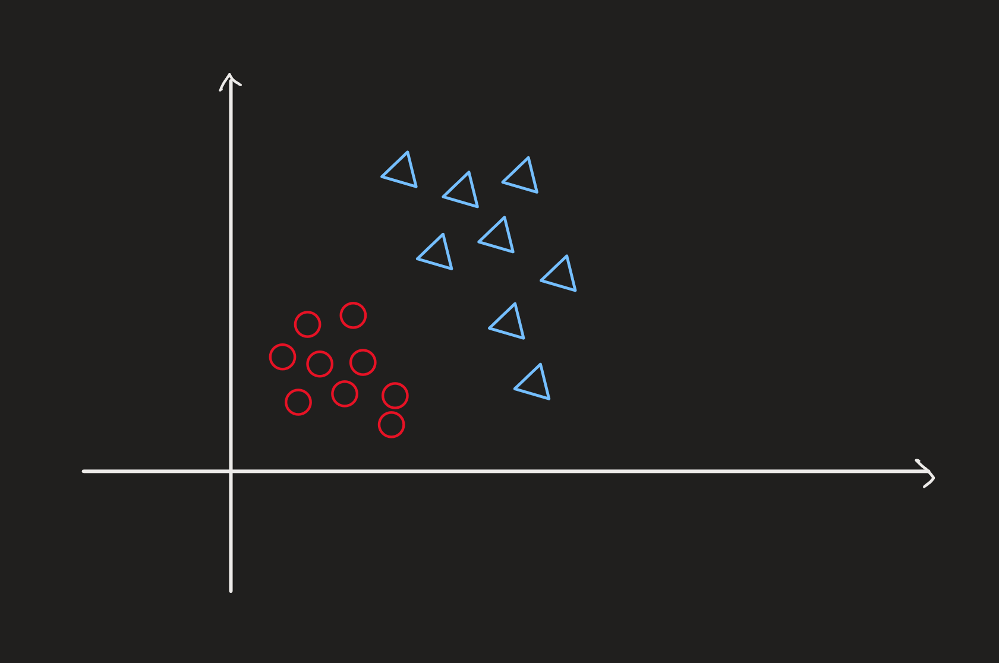
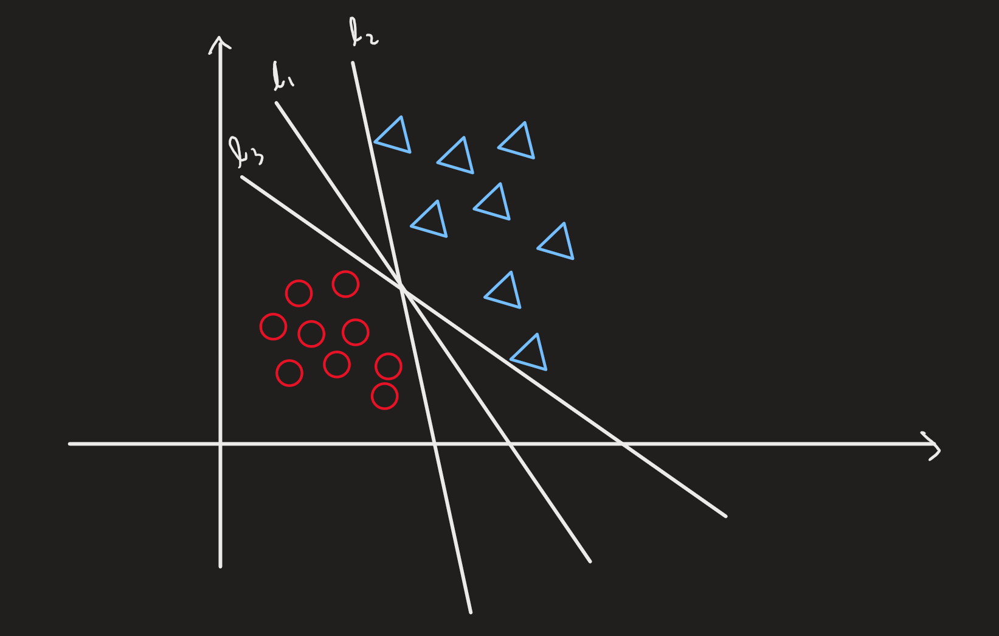
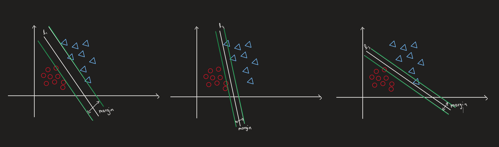

## 支持向量机(线性) $SVM$

### 引入

&emsp; $SVM$ 用于解决的问题也是 $classification$，这里 $y \in \{-1, 1\}$

&emsp; 比如说这样一个需要分类的训练数据：

&emsp; 我们可以有很多直线来分开这两坨东西，就像这样：

&emsp; 我们看到这三条线 $l_1, l_2$ 和 $l_3$，我们显然可以看出来 $l_1$ 比 $l_2$ 和 $l_3$ 要更优秀，但是我们怎么定义这个所谓的 "优秀" 呢？

### 间隔 $Margin$ 和 最小化 $|w|$

&emsp; 我们这样理解，考虑将 $l$ 在样本空间中平移，直到这条直线第一次碰到两组东西数据时停止。这样我们能得到两根 "边界线"（图中绿色的线）。

&emsp; 我们发现，我们认为最优秀的线所形成的 "边界线" 的距离是最大的，我们把这个距离成为**间隔** $margin$。于是在 $SVM$ 的思想中，我们就是要找到 $margin$ 最大的那条线。

&emsp; 我们把这些"**平移过程中第一次碰到的向量**"称为**支持向量**

&emsp; 我们把这条线根据之前的习惯写成这样：

$$ h(x) = w^Tx $$

&emsp; 然后我们考虑如何计算出 $margin$。首先对于一个支持向量 $x^{(i)}$ 来说，它到直线的距离可以写成：

$$ d = \frac{\bigg|\sum\limits_{j = 0}^n w_jx^{(i)}_j \bigg|}{\sqrt{\sum\limits_{j = 1}^n w_j^2}} = \frac{\bigg|w^Tx^{(i)}\bigg|}{|w|} $$

&emsp; 然后又因为我们知道，$h(x) = w^Tx$ 和 $h(x) = (aw)^Tx$ 本质上表示的是同一条直线（其中 $a$ 是常数）。所以我们可以用 $a$ 来放缩直线 $h(x)$，使得 $|(aw)^Tx^{(i)}| = 1$。

&emsp; 此时，支持向量 $x^{(i)}$ 到直线的距离就是：

$$ d = \frac1{|w|} $$

&emsp; 我们希望 $d$ 最大，那么我们就希望 $|w|$ 最小了。

&emsp; 但是这只是对于支持向量来说，那么对于其他向量来说又要满足什么要求呢？

### 限制条件

&emsp; 对于其他非支持向量 $x^{(j)}$ 来说，$x^{(j)}$ 到直线的距离显然是大于支持向量 $x^{(i)}$ 的，所以我们有：

$$ d_{x^{(j)}} = \frac{\bigg|w^Tx^{(j)}\bigg|}{|w|} > d_{x^{(i)}} = \frac 1{|w|} $$

&emsp; 于是我们有：

$$ \bigg|w^Tx^{(j)}\bigg| > 1 $$

&emsp; 那么对于所有向量来说：

$$ \bigg|w^Tx\bigg| \ge 1 $$

&emsp; 如果把绝对值去掉的话，我们就要分是 $y$ 属于 $1$ 类还是 $-1$ 类了。而经过分类讨论我们会发现，对于所有向量 $x$，我们都有：

$$ y^{(i)}[w^Tx^{(i)}] \ge 1 \;\;\;\;\;\;\;(i = 1 \sim m) $$

### 总结

&emsp; 于是我们可以得到支持向量机想要我们做的事就是这样的：

$$
\begin{aligned}
\min\limits_{w} \frac 12 &|w| \\
&s.t. \; \;y^{(i)}[w^Tx^{(i)}] \ge 1
\end{aligned}
$$

