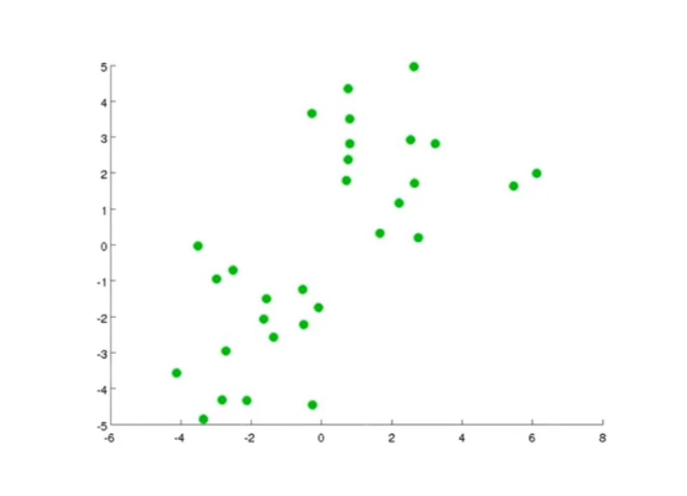
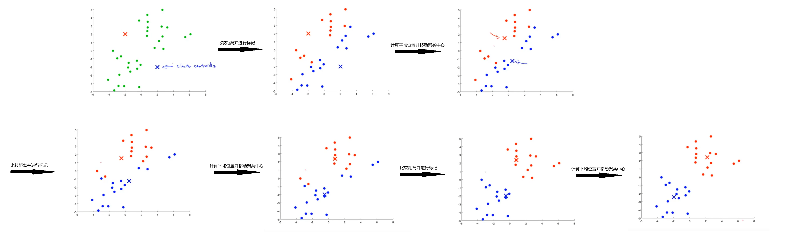

## K均值聚类

### 算法过程

&emsp; $K-means$ 是 聚类 $clustering$ 算法的一种，就是给你一坨东西，让你给他们分类：

&emsp; 我们的 $K-means$ 大概是这样一个流程：

1. 第一步随机生成两个点（因为这里我想分两类，你想分几类你就弄几个点），标记为两个**聚类中心** $cluster \; centriod$，像这样：

2. 然后重复以下两个步骤：

&emsp;&emsp; 1. 遍历每个点 $x^{(i)}$，分别计算点 $x^{(i)}$ 到两个聚类中心的距离 $d_1$ 和 $d_2$，然后比较大小。并标记这个点为距离更小的那一类 

&emsp;&emsp; 2. 分别遍历同一类的所有点，计算这些点的几何平均位置，并把聚类中心移动到这个位置

&emsp; 这样说起来可能很抽象，我们还是用图像来更清晰的表示一下这个过程：

&emsp; 图画到这里我们就能明显的观察到两个聚类已经被划分好了。

### 优化目标函数

&emsp; 像前面介绍的线性回归、逻辑回归、$SVM$ 一样，这里的 $K-means$ 也有一个用于优化的函数：

&emsp; $notation$：$c_i$ 表示点 $x_i$ 的类别，$\mu_k$ 表示聚类中心 $k$，$\mu_{c_i}$ 表示 $x_i$ 所属的那个聚类中心

$$ J(c_1, \cdots, c_m, \mu_1, \cdots, \mu_K) = \frac{1}{m}\sum_{i = 1}^m |x_i - \mu_{c_i}|^2 $$

&emsp; 我们要做的就是：

$$ \min\limits_{c, \mu} J(c_1, \cdots, c_m, \mu_1, \cdots, \mu_K) $$

&emsp; 看得出来，这就是要最小化所有点 $x_i$ 与其所属的聚类中心 $\mu_{x_i}$ 的距离的平方和。

### 跑$114514$次 $k-means$

&emsp; 可能你也注意到了，我们如果只跑一遍 $k-means$ 的话可能不会得到一个很好的分类方案，所以我们考虑每次随机初始化聚类中心，然后跑很多遍（取决于你的数据规模和时间）$k-means$，对于每次计算出来的 $c, \mu$ 算出它的 $J(c, \mu)$，然后在其中选择 $J(c, \mu)$ 最小的那个分类方案作为最后的答案。